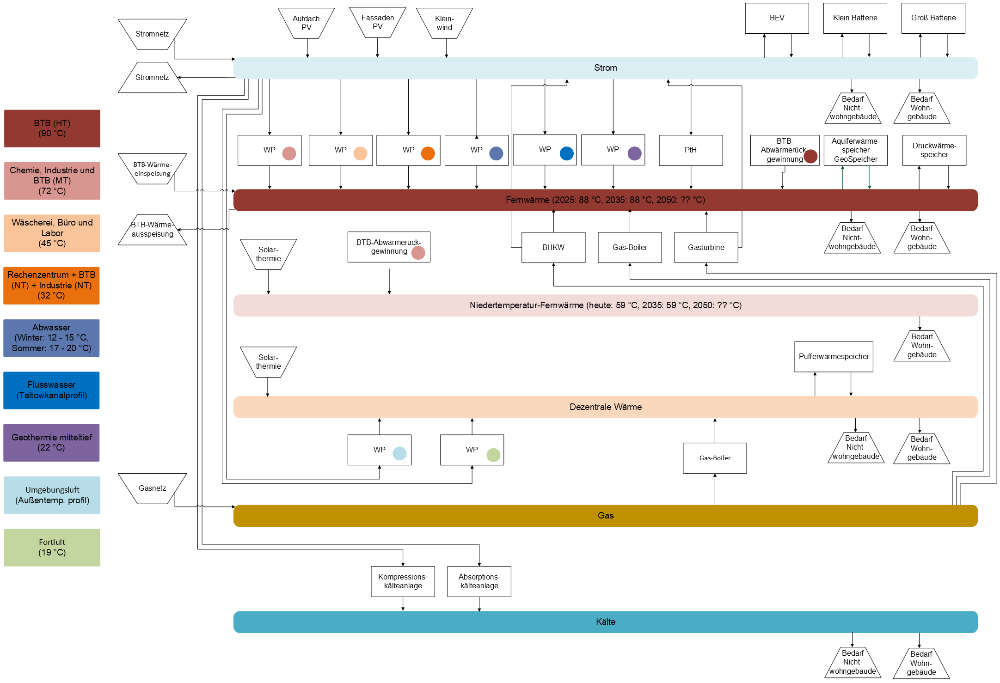

# Energy System Model Berlin-Adlershof – Documentation

The repository __resqenergy/es-adlershof__ builds oemof.tabular data packages for the energy system modeling of the Berlin-Adlershof Science and Technology Park as part of the research project [ResQEnergy](https://www.transformresq.de/projekte/resqenergy).

## Getting started

- [Installation and Setup](setup.md) — installation, environment variables, Makefile pipeline
- [Data structures](datenstrukturen.md) — raw data (`raw/`), intermediate data (`datasets/`), and data packages (`datapackages/`)
- [Scripts](scripts/skripte.md) — documentation of all processing and preparation steps for the input data

## Energy system overview

## Scenario overview

TODO