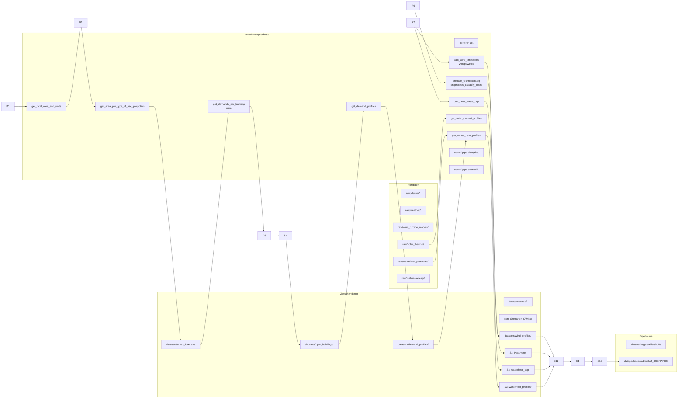

# Energiesystem Adlershof – Dokumentation

Dieses Projekt erstellt oemof.tabular-Datenpakete für das Energiesystem des Stadtquartiers Adlershof (Berlin) im Rahmen des ResQEnergy-Projekts. Die Datenpakete bilden verschiedene Klimaszenarien (RCP 2.6, 4.5, 8.5) und Zeithorizonte (2035, 2050) ab und dienen als Eingabe für die Energiesystemoptimierung mit oemof.tabular.

## Datenpipeline

## Einstieg

- [Einrichtung und Ausführung](setup.md) — Installation, Umgebungsvariablen, Makefile-Pipeline
- [Datenstrukturen](datenstrukturen.md) — Rohdaten (`raw/`), Zwischendaten (`datasets/`) und Datenpakete (`datapackages/`)
- [Skripte](scripts/) — Dokumentation aller Verarbeitungsschritte
